# BÁO CÁO KẾT QUẢ BÀI LAB - DAY 10
## Đề tài: Data Pipeline And Data Observability for RAG System
**Họ và tên:** Nguyễn Đức Cường (Mã học viên: 2A202600794 | GitHub: [DucCuong293](https://github.com/DucCuong293))  
**Thời gian thực hiện:** 10/06/2026

---

## 1. Giới thiệu & Mục tiêu bài Lab
Mục tiêu chính của bài lab này là xây dựng một hệ thống xử lý dữ liệu (ETL Data Pipeline) hoàn chỉnh cho ứng dụng RAG (Retrieval-Augmented Generation), đồng thời tích hợp các giải pháp giám sát chất lượng dữ liệu (Data Quality Observability) để kịp thời phát hiện sự cố dữ liệu bị lỗi (data corruption) làm ảnh hưởng tới câu trả lời của LLM Agent, và tự động hóa quy trình khôi phục dữ liệu (Repair) từ nguồn gốc.

Dự án sử dụng:
*   **LLM Provider:** OpenAI (`gpt-4o-mini`) được thiết lập thông qua tệp cấu hình `.env`.
*   **Vector Database:** ChromaDB làm Vector Store lưu trữ chỉ mục tài liệu.
*   **Embedding Model:** `sentence-transformers/all-MiniLM-L6-v2` từ Hugging Face.
*   **Môi trường thực thi:** Quản lý gói bằng `uv` chạy trên Python 3.13.

---

## 2. Các công việc và Module đã hoàn thiện
Hệ thống được thiết kế theo dạng mô-đun hóa cao, tách biệt nhiệm vụ rõ ràng:

### 2.1. Module Data Ingestion ([crossref.py](src/ingestion/crossref.py))
*   **Hàm `fetch_source_records`:** Gọi API Crossref (`https://api.crossref.org/works`) tải các công trình nghiên cứu dựa trên từ khóa truy vấn cấu hình. Triển khai cơ chế retry thông minh với lũy thừa thời gian chờ khi gặp mã lỗi quá tải HTTP 429 hoặc 503. Tự động lưu phản hồi gốc ra tệp `crossref_response.json` và lưu danh sách bản ghi đã parse ra tệp `crossref_records.json` để làm bộ nhớ đệm (caching).
*   **Hàm `parse_crossref_payload`:** Phân tích cú pháp phản hồi thô của API, sử dụng biểu thức chính quy (regular expressions) loại bỏ triệt để các thẻ XML (ví dụ `<jats:p>`) trong phần tóm tắt để làm sạch văn bản thô, ánh xạ thành danh sách đối tượng cấu trúc `PaperRecord`.
*   **Hàm `load_raw_records`:** Đọc từ bản chụp cache JSON trên đĩa để phục hồi danh sách `PaperRecord` mà không cần gọi API nhiều lần khi debug.

### 2.2. Module Data Cleaning & Modeling ([cleaning.py](src/ingestion/cleaning.py))
*   **Hàm `build_clean_dataframe`:** Xử lý làm sạch và chuyển đổi cấu trúc dữ liệu thô sang Pandas DataFrame:
    1.  Chuẩn hóa khoảng trắng thừa trong tiêu đề và nội dung.
    2.  Tính toán độ tươi mới của tài liệu (`age_days` tính từ ngày xuất bản tới ngày chạy hiện tại).
    3.  Tạo ra cấu trúc văn bản nhúng `text_for_embedding` chất lượng cao định dạng: 
        `Title: {title}\nAuthors: {authors}\nCategories: {categories}\nSummary: {summary}`
    4.  Lọc bỏ các bản ghi không hợp lệ (thiếu mã ID, tiêu đề quá ngắn hoặc phần tóm tắt rỗng).
    5.  Loại bỏ trùng lặp khóa chính `paper_id` và tiêu đề `title`.
    6.  Sắp xếp tập dữ liệu theo ngày xuất bản giảm dần (ưu tiên bài báo mới nhất).

### 2.3. Module Test Set Generation ([testset.py](src/evaluation/testset.py))
*   **Hàm `build_test_set`:** Sinh tự động bộ câu hỏi đánh giá gồm 20 mẫu từ dữ liệu sạch của hệ thống. Bộ câu hỏi chia đều làm 4 nhóm chủ đề: Tác giả (`Who authored...`), Ngày xuất bản (`When was...`), Thể loại (`What categories...`), và Tóm tắt đóng góp. Ground truth của các câu hỏi được ánh xạ trực tiếp từ metadata sạch để đảm bảo tính xác thực khi chấm điểm.

### 2.4. Module Data Quality & Observability ([quality.py](src/observability/quality.py))
*   **Hàm `run_data_quality_checks`:** Chạy 5 bài kiểm tra chất lượng dữ liệu:
    1.  *Row count check:* Kiểm tra số lượng bản ghi (đảm bảo $\ge 3$ bản ghi).
    2.  *Unique IDs check:* Đảm bảo không trùng lặp và không trống ID.
    3.  *No null titles check:* Đảm bảo không trống tiêu đề.
    4.  *Summary length check:* Kiểm tra độ dài tóm tắt bài báo (tránh tóm tắt rỗng hoặc quá ngắn dưới 30 ký tự).
    5.  *Freshness check:* Đảm bảo tuổi dữ liệu nằm trong ngưỡng cho phép (180 ngày).
*   **Hàm `build_freshness_report`:** Kết xuất báo cáo độ tươi mới của dữ liệu thô (ngày xuất bản mới nhất, cũ nhất, số lượng bản ghi bị quá hạn).

### 2.5. Module Reporting ([reporting.py](src/observability/reporting.py))
*   **Hàm `generate_phase1_report`:** Tạo file markdown báo cáo baseline.
*   **Hàm `generate_corruption_report`:** Tạo file markdown báo cáo so sánh đa trạng thái và nhúng trực quan hóa biểu đồ SVG.

### 2.6. Module Data Corruption ([corruption.py](src/ingestion/corruption.py))
*   **Hàm `corrupt_clean_dataframe`:** Giả lập 6 sự cố dữ liệu thực tế:
    1.  Xóa 20% bản ghi mới nhất.
    2.  Làm trống (blank) một số tóm tắt.
    3.  Chèn chuỗi ký tự nhiễu lỗi vào tóm tắt.
    4.  Cắt ngắn tiêu đề bài báo xuống 15 ký tự.
    5.  Cũ hóa ngày xuất bản (lùi về 2010).
    6.  Nhân bản hàng gây trùng lặp dữ liệu.
    7.  Sinh lại cột `text_for_embedding` từ dữ liệu lỗi để phá hoại chỉ mục vector store.

### 2.7. Module Pipelines Orchestration ([phase1.py](src/pipelines/phase1.py) & [corruption_flow.py](src/pipelines/corruption_flow.py))
*   Lắp ráp toàn bộ các bước thành quy trình tự động hóa chạy một lệnh từ đầu đến cuối.

---

## 3. Kết quả thực nghiệm và Trực quan hóa

### 3.1. Bảng so sánh các chỉ số thực tế thu được

Dưới đây là bảng so sánh các thông số đo lường hiệu năng của hệ thống RAG và chỉ số giám sát chất lượng qua 3 giai đoạn:

| Chỉ số / Trạng thái | Baseline (Dữ liệu chuẩn) | Corrupted (Dữ liệu lỗi) | Repaired (Sau sửa lỗi) | Tác động của lỗi dữ liệu |
| :--- | :---: | :---: | :---: | :---: |
| **Tổng số bản ghi sạch** | 23 | 21 | 23 | Bị mất 2 bản ghi |
| **Kiểm định chất lượng (DQ)** | **PASSED** | **FAILED** | **PASSED** | DQ check thất bại |
| **Giám sát độ tươi mới (Freshness)**| **FRESH** | **STALE** | **FRESH** | Phát hiện dữ liệu quá hạn |
| **Tỷ lệ truy xuất trúng (Hit Rate)** | 100.0% | 80.0% | 100.0% | **Giảm 20.0%** |
| **Điểm Token F1 trung bình** | 100.0% | 76.6% | 100.0% | **Giảm 23.4%** |
| **Độ chính xác của LLM Judge** | 100.0% | 80.0% | 100.0% | **Giảm 20.0%** |
| **Điểm số LLM Judge (1-5)** | 5.00 | 4.25 | 5.00 | **Giảm 0.75đ** |

### 3.2. Biểu đồ trực quan so sánh hiệu năng
Biểu đồ SVG so sánh trực quan hiệu năng hệ thống RAG được đính kèm dưới đây:



---

## 4. Nhận xét & Kết luận
1.  **Ảnh hưởng nghiêm trọng của sự cố dữ liệu:** Khi dữ liệu đầu vào bị lỗi (tiêu đề bị cắt ngắn, mất tóm tắt, xuất hiện thông tin nhiễu), khả năng tìm kiếm ngữ nghĩa của ChromaDB bị suy giảm nặng nề. Điều này khiến RAG Agent truy xuất sai văn bản làm ngữ cảnh, trực tiếp kéo tụt độ chính xác câu trả lời của LLM xuống còn 80% và điểm Token F1 giảm 23.4%.
2.  **Giá trị của Data Observability:** Nhờ các bài DQ check và Freshness check tự động, hệ thống ngay lập tức phát hiện trạng thái dữ liệu không đạt yêu cầu (**FAILED/STALE**) giúp cảnh báo sớm sự cố đường ống dữ liệu trước khi ảnh hưởng đến khách hàng.
3.  **Khả năng tự khôi phục dữ liệu:** Quy trình Repair đã chứng minh hiệu quả tuyệt đối khi tự động kéo lại bản ghi sạch gốc, tái lập lại chỉ mục Vector Store sạch và khôi phục hoàn toàn 100% hiệu năng của hệ thống RAG như ban đầu.

---

## 5. Hướng dẫn chạy lại hệ thống (Reproduce)
Để chạy lại toàn bộ hệ thống từ đầu, bạn chỉ cần thực hiện 2 lệnh sau trên terminal:

1.  **Chạy Baseline Flow (Pha dữ liệu sạch):**
    ```bash
    uv run python script/run_phase1.py
    ```
    *Xem báo cáo baseline tại:* `data/reports/phase1_report.md`

2.  **Chạy Corruption & Recovery Flow (Pha lỗi & tự sửa lỗi):**
    ```bash
    uv run python script/run_corruption_flow.py
    ```
    *Xem báo cáo so sánh đối chiếu tại:* `data/reports/corruption_report.md`
